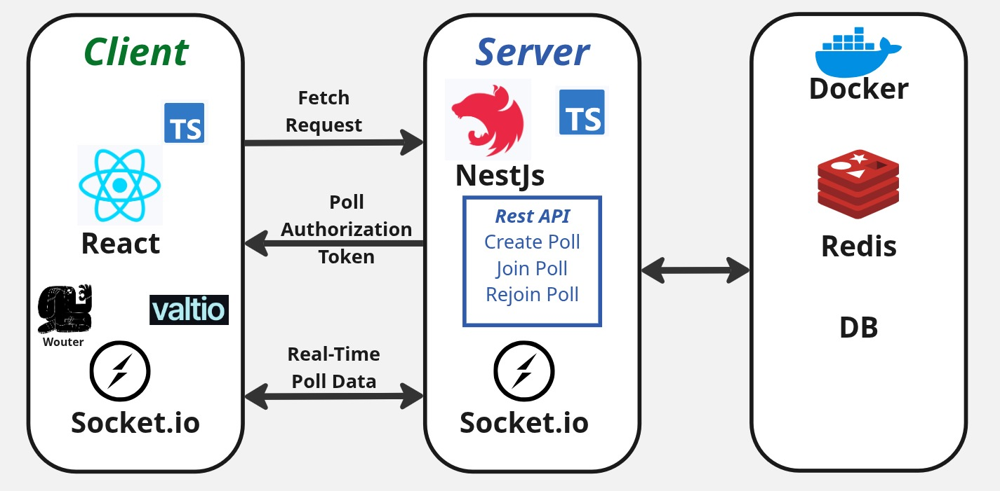

# Click2Vote
<h3><i>
This project is a Real-Time Ranked-Choice Voting App that allows users to create polls, invite friends to participate, add nominations, cast their votes, and view the final results in real time. 


</i></h3>
▶️ [Watch the demo on YouTube](https://youtu.be/UyStdT6uVcY)

---

## Framework Design


---


---

## Technologies
<h4>
Typescript | NestJs |  Redis | Socket.io | Docker | ReactJs
</h4>

---

## Features
<h4>
<ul>
<li>Real-time updates via WebSockets (Socket.IO)</li>
<li>Ranked‑choice voting: voters select preferences and final tallies use Instant-Runoff logic.</li>
<li>Backend: NestJS (TypeScript), REST APIs + WebSocket gateway.</li>
<li>Frontend: React (TypeScript), responsive UI for voting and dynamic results.</li>
<li>In‑memory vote storage: Redis‑JSON or Redis as backend store.</li>
<li>Clean architecture: controllers, services, modules, repositories, gateways, guards, pipes, interceptors.
</li>
</ul>
</h4>

---

## How to Run
1. Clone the repo
2. Download Docker and Docker Compose
3. Navigate to the project repo and run the following
```
# In root directory
npm install 
docker-compose up

cd backend/ && npm install && cd ..
# Configure Redis connection settings in .env

cd frontend/ && npm install && cd ..

npm run server
npm run client
```

---

